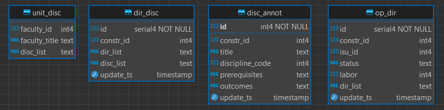
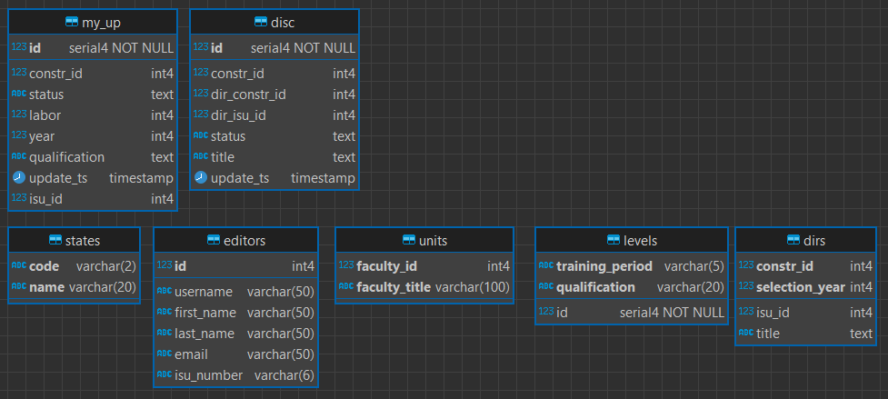
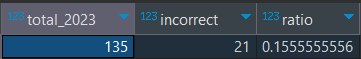

# Прикладные пакеты анализа данных. Лаб. работа №2  

## Задание

- доработать модель на слое stg с учетом эндпойнтов для получения информации о структурных подразделениях и статусах, а также с учетом json'ов c учебными планами;
- доработать модель на stg с учетом [SCD2](https://en.wikipedia.org/wiki/Slowly_changing_dimension);
- доработать скрипт из dag'а get_data для сбора данных по всем эндпойнтам;
- доработать модель данных для слоя dds, учивающую все необходимые поля для построения дэшборда;
- создать скрипт для переноса данных из stg на dds;
- спроектировать модель для cdm (слой витрин);
- подключить Metabase к модели на слое cdm (при первом подключении нужно зарегистрироваться, хост:порт de-pg-cr-af:5432);
- сформировать дэшборд в соответствии с требованиями.

Требования:

- доля учебных планов в статусе "одобрено" (только для 2023 года)
- доля/количество учебных планов с некорректной трудоемкостью (корректная трудоемкость у бакалавров - 240, а магистров - 120)
- доля заполненных аннотаций в динамике
- долю дисциплин в статусе "одобрено" в динамике

В разрезах:

- ОП (с учетом года)
- структурных подразделений для дисциплин
- уровней образования (бакалавр, специалист, магистр)
- структурных подразделений для ОП
- учебного года (текущий и следующий)

## Основная идея

1. Создаются таблицы слоя stg. (скрипт stg\_dll.sql) Таблицы этого слоя хранят сырые данные.
2. Раз в какое-то время данные берутся с разных API и добавляются в таблицы слоя stg. При этом данные не обрабатываются (вложенные в список объекты Json не разбираются)
3. Создаются таблицы слоя dds. (скрипт dds\_dll.sql)
4. Нужные для логики витрин поля извлекаются из таблиц stg, преобразуются, структурируются и добавляются в таблицы на слой dds.
5. Наконец, слой cdm предоставляет готовые для анализа данные, которые могут быть использованы для создания отчетов, дашбордов и другой бизнес-аналитики.

## Предметная область

- Структурные подразделения (факультеты) реализуют дисциплины.
- У каждой дисциплины есть код и редакторы, статус и аннотации.
- На каждом направлении (“Мобильные и облачные технологии”) есть дисциплины, год набора на направление, трудоемкость программы и уровень образования.

## Подготовка инфраструктуры

1. Создал виртуальное окружение через poetry (команда poetry init)
2. Добавил пакеты pandas, airflow-apache, apache-airflow-providers-postgres (poetry add …)
3. Запустил собрал и запустил контейнеры ‘docker compose up -d’
4. Подключился к БД через DBeaver (пароль jovyan):

    

5. Зарегистрировался на op.itmo.ru (логин: asdfg, пароль: itmo2023)
6. Зашел в Airflow по localhost:3000/airflow (логин: AirflowAdmin, пароль: airflow\_pass)
7. Вписал переменные в Airflow (Admin -> Variables):

    

8. Добавил соединение к БД (Admin -> Connections):

    

9. Запустил скрипт stg\_dll.sql через DBeaver (создались таблицы для сырых данных)
10. Запустил даг get\_data, убедился что данные появились в таблице stg.work\_programs

## Проверка запросов

Использовалось расширение Thunder Client.

Токен брался из куков op.itmo.ru (csrftoken)


## Модель с учётом SCD2

### Слой stg



#### disc_list

Структурные подразделения (факультеты) и дисциплины, которые они реализуют (SCD0)  
endpoint 1: [https://op.itmo.ru/api/record/structural/workprogram](https://op.itmo.ru/api/record/structural/workprogram)

disc_list:

    {
        "id": 17969,
        "title": "Название дисциплины",
        "discipline_code": "21201",
        "editors": [
            {
                "id": 1277,
                "username": "313131",
                "first_name": "Иван",
                "last_name": "Иванов",
                "email": "example@gmail.com",
                "isu_number": "313131"
            }
        ]
    }

#### dir_disc

Показывает какие дисциплины есть на направлении

- из направления берется год набора
- из дисциплин берется статус (его динамику надо отслеживать)

endpoint 2: [https://op.itmo.ru/api/record/academic\_plan/academic\_wp\_description/all](https://op.itmo.ru/api/record/academic\_plan/academic\_wp\_description/all)

dir_list: в каждом таком списке только одно направление

    [
        {
            "id": 6859,
            "ap_isu_id": 10572,
            "year": 2018,
            "title": "Нанофотоника и квантовая оптика"
        }
    ]

disc_list:

    [
        {
            "id": 2623,
            "discipline_code": "5546",
            "title": "История",
            "description": null,
            "status": "WK"
        },
        {
            "id": 2625,
            "discipline_code": "5664",
            "title": "Физическая культура",
            "description": null,
            "status": "WK"
        }
    ]

#### op_dir

Образовательная программа и направления

- берется статус и трудоёмкость образовательной программы (их динамика отслеживается)
- из направления возьмется год набора и уровень образования

endpoint 4: [https://op.itmo.ru/api/academicplan/detail/{op\_id}?format=json](https://op.itmo.ru/api/academicplan/detail/{op\_id}?format=json)

dir_list:

    [
        {
            "id": 6859,
            "year": 2018,
            "qualification": "bachelor",
            "title": "Нанофотоника и квантовая оптика",
            "field_of_study": [
                {
                    "number": "16.03.01",
                    "id": 15772,
                    "title": "Техническая физика",
                    "qualification": "bachelor",
                    "educational_profile": null,
                    "faculty": null
                }
            ],
            "plan_type": "base",
            "training_period": 0,
            "structural_unit": null,
            "total_intensity": 0,
            "military_department": false,
            "university_partner": [],
            "editors": []
        }
    ]

### Слой dds



- my_up (для требования 1 и 2)
- disc (для требования 3 и 4)
- остальные таблицы используются для просмотра данных в разрезах
  
## Реализация динамики

На примере с отслеживаем изменений трудоёмкости и статусов в учебных планах:

Перед тем как добавиться в таблицу stg.op_dir каждый новый датафрейм проверяется на новизну:

```python
# Проверяем, существует ли запись с такими же данными
existing_data = postgres_hook.get_pandas_df(
    sql.SQL('''
        WITH t AS (
        SELECT *
        FROM stg.op_dir
        WHERE constr_id = {}
        ORDER BY update_ts DESC
        LIMIT 1
        )
        SELECT *
        FROM t
        WHERE constr_id = {}
        AND labor = {}
        AND status = {}
        AND dir_list = {}
    ''')
    .format(
        sql.Literal(df['constr_id'][0])
        ,sql.Literal(df['constr_id'][0])
        ,sql.Literal(df['labor'][0])
        ,sql.Literal(df['status'][0])
        ,sql.Literal(df['dir_list'][0])
    )
)
if existing_data.empty:
    postgres_hook.insert_rows("stg.op_dir", df.values, target_fields=target_fields)
    logging.info(f"Added constr_id={df['constr_id'][0]}")
```

Аналогично, для добавления на слой dds, выполняется проверка, есть ли уже в таблице этот рабочий план с такими же значениями:

```python
def my_up():
PostgresHook(postgres_conn_id="PG_WAREHOUSE_CONNECTION").run(
    """
    -- берет только последнюю по времени запись для каждого constr_id (при условии что rn = 1)
    WITH NewRecords AS (
        SELECT
            id,
            constr_id,
            isu_id,
            status,
            labor,
            (json_array_elements(dir_list::JSON)->>'year')::integer AS year,
            json_array_elements(dir_list::JSON)->>'qualification' AS qualification,
            update_ts,
            ROW_NUMBER() OVER (PARTITION BY constr_id ORDER BY update_ts DESC) AS rn
        FROM stg.op_dir
    )
    INSERT INTO dds.my_up (
        constr_id,
        isu_id,
        status,
        labor,
        year,
        qualification,
        update_ts
    )
    SELECT
        nr.constr_id,
        nr.isu_id,
        nr.status,
        nr.labor,
        nr.year,
        nr.qualification,
        nr.update_ts
    FROM NewRecords nr
        LEFT JOIN dds.my_up mu ON mu.constr_id = nr.constr_id
    WHERE
        nr.rn = 1
        AND (
            mu.constr_id IS NULL
            OR mu.status != nr.status
            OR mu.labor != nr.labor
        )
    """
)
```

## Результаты

1. Доля учебных планов в статусе одобрено для 2023 года:

    ```sql
    with t as(
        SELECT
            COUNT(*) AS total_2023,
            SUM(CASE WHEN status = 'verified' THEN 1 ELSE 0 END) AS verified_2023
        FROM dds.my_up
        WHERE year = 2023
    )
    select cast(verified_2023 as numeric) / total_2023 as ratio
    from t
    ```

    

2. Доля/количество учебных планов с некорректной трудоемкостью (только для 2023 года, корректная трудоемкость у бакалавров - 240, а магистров - 120):

    ```sql
    WITH t AS (
        SELECT
            COUNT(*) AS total_2023,
            SUM(
            CASE
                WHEN (
                    (qualification = 'bachelor' AND labor != 240)
                    OR
                    (qualification = 'master' AND labor != 120)
                ) THEN 1
                ELSE 0
            END
        ) AS incorrect_laboriousness_2023
    FROM dds.my_up
    WHERE year = 2023
    )
    SELECT
        total_2023
        ,incorrect_laboriousness_2023 AS incorrect
        ,CAST(incorrect_laboriousness_2023 AS numeric) / total_2023 AS ratio
    FROM t;
    ```

    

3. Также, с помощью поля update\_ts, на слое cdm можно будет отслеживать динамику статусов и трудоёмкости учебных планов. Проверка выполнялась путем изменения значений статусов и трудоемкости на слое stg.

    

    

    Аналогично для статусов и аннотаций дисциплин.
